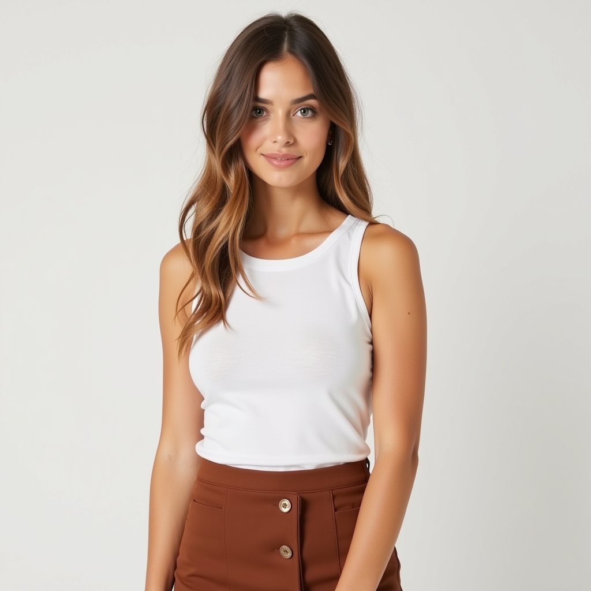

# Advancing Virtual Try-On: A Multi-Step Evaluation Pipeline for Image Generation, Garment Testing, and Resolution Enhancement
The rapid advancements in virtual try-on technology have opened new frontiers in digital fashion and e-commerce, yet challenges in garment fidelity and visual realism persist. In this study, we present a comprehensive evaluation pipeline to assess the capabilities and limitations of state-of-the-art try-on models like IDM-VTON. The process begins with generating high-quality, digitally created models in diverse outfits and environments using the black-forest-labs/FLUX.1-dev model, enhanced with the Flux-uncensored-v2 weights. Garments sourced from the internet are seamlessly applied to these models using IDM-VTON, leveraging its advanced diffusion-based approach to ensure authenticity and detail preservation. To further refine the visuals, image resolution is enhanced through the jasperai/Flux.1-dev-ControlNet-Upscaler, creating outputs that meet real-world expectations. This article delves into the strengths and gaps identified in try-on performance, offering insights into the future potential of virtual try-on systems.

  
  
    
  

I employed the **black-forest-labs/FLUX.1-dev** model in conjunction with the **enhanceaiteam/Flux-uncensored-v2** weights to generate high-quality digital models as a foundation for virtual try-on workflows. The process leverages state-of-the-art **diffusion-based generative modeling** to synthesize realistic and customizable human models tailored for subsequent garment simulations.

The **black-forest-labs/FLUX.1-dev** model operates as a base architecture optimized for generating detailed human models by employing a latent diffusion process. This approach iteratively refines noise-injected latent representations to recover high-resolution image data, ensuring photorealism and anatomical accuracy. Diffusion models excel in generating nuanced details like skin texture, hair features, and pose alignment by learning the distribution of training data and reversing the noise diffusion process.

To enhance the outputs' versatility and resolution, I integrated the **enhanceaiteam/Flux-uncensored-v2** weights into the pipeline. These weights are pre-trained on diverse datasets emphasizing varied human postures, lighting conditions, and ethnic diversity, augmenting the base model's ability to generalize across scenarios. The weights act as fine-tuned parameters guiding the diffusion process towards more consistent outputs, particularly when handling challenging attributes like occlusions or edge details.

The synthesis begins with a Gaussian noise vector, which progressively transitions into a coherent image through a series of denoising steps. Each step is guided by the learned representations encoded in the model and the fine-tuned weights. This process allows for precise control over attributes like pose, body proportions, and even facial expressions, making it an ideal precursor for try-on applications.

In this project we explored the following Vitrual Try-on models and selected IDM-VTON to explore furhter for it's superior performacne.

* sangyun884/HR-VITON
* rlawjdghek/StableVITON
* Zheng-Chong/CatVTON
* shadow2496/VITON-HD
* yisol/IDM-VTON

The original IDM-VTON article is available here https://arxiv.org/abs/2403.05139 and a summary is provided below:

The IDM-VTON framework addresses image-based virtual try-on by rendering a person wearing a curated garment given images of both the person and the garment. IDM-VTON introduces a cutting-edge approach to image-based virtual try-on, enabling the creation of realistic images of a person wearing curated garments while maintaining garment fidelity and visual naturalness. Unlike previous methods, which often compromise garment details for improved image quality, IDM-VTON combines the strengths of diffusion-based generative modeling with novel semantic encoding techniques to overcome these challenges. 

At the core of the framework is a diffusion model enhanced by a base UNet architecture, augmented with two key modules that encode garment semantics. High-level semantic features are extracted through a visual encoder and integrated into the cross-attention layer, while low-level garment details are processed through a parallel UNet and fused into the self-attention layer. This dual-level encoding ensures both the overall alignment of the garment with the person and the preservation of intricate textures and details. Additionally, IDM-VTON incorporates detailed natural language descriptions for both garments and person images, leveraging the contextual power of text-to-image diffusion models to enhance the authenticity and personalization of the generated visuals.

A significant innovation in IDM-VTON is its customization mechanism, where fine-tuning the decoder layers of the UNet for specific garment-person image pairs enhances fidelity and robustness, especially in complex real-world scenarios. Experimental evaluations demonstrate that IDM-VTON outperforms both GAN-based and earlier diffusion-based models in generating photorealistic virtual try-on images while maintaining garment and body coherence. Its versatility makes it particularly effective for "in-the-wild" applications involving diverse body poses and garment configurations.

Despite its advancements, IDM-VTON has some limitations. It struggles to preserve fine human attributes, such as tattoos or skin details, in masked regions, suggesting the need for future methods to condition generation on these attributes. Furthermore, while the model effectively utilizes captions to align garment and person images, broader applications for textual prompts, such as controlling specific garment designs, remain unexplored.

Overall, IDM-VTON represents a significant leap forward in virtual try-on technology. By combining sophisticated diffusion modeling, semantic encoding, and real-world adaptability, it delivers highly authentic and customizable try-on experiences. However, its success underscores the importance of responsible use to protect intellectual property and prevent misuse, ensuring the technology is a force for innovation in fashion and e-commerce.

We identified, the most efficient way to run this model is by using the Gradio web application available in the repo (https://github.com/yisol/IDM-VTON). A running version with required packages is attached in this repo. The compute used was Google Cloud A100 GPU. This is a NVIDIA Ampere A100, is the cornerstone of the A2 VM family, designed to excel in high-performance computing (HPC) and demanding applications like machine learning. Boasting 40GB of high-performance HBM2 memory and up to 20 times faster compute performance than its predecessor. With 6,912 FP32/INT32 CUDA cores and 3456 FP64 CUDA cores, it offers robust processing power. The A2 VM family includes A2 Ultra, equipped with A100 80GB GPUs and Local SSD disks, and A2 Standard, featuring A100 40GB GPUs, providing users with flexibility to choose the optimal configuration for their specific needs.

  
  
  
  

By default, model outputs are in 675x675 image size. The resolution of those images were increased to 1024x1024 using upscaler. We are utilizing **FluxControlNetPipeline**, leveraging the "jasperai/Flux.1-dev-Controlnet-Upscaler" and "black-forest-labs/FLUX.1-dev" models to achieve high-quality, detailed image upscaling. This pipeline integrates **ControlNet** with a diffusion-based generative process, providing both precision and flexibility in enhancing image resolution. 

The `FluxControlNetModel.from_pretrained` method loads the pre-trained ControlNet model, "jasperai/Flux.1-dev-Controlnet-Upscaler," which is specifically designed to guide the diffusion process for upscaling tasks. ControlNet acts as a conditioning network, enabling precise control over the structure and details of the output image by injecting additional guidance during the generative process. The model's weights are loaded in the **bfloat16** precision format, reducing memory usage while maintaining computational efficiency, especially useful for large-scale upscaling tasks.

The `FluxControlNetPipeline` integrates the pre-trained base model ("black-forest-labs/FLUX.1-dev") with the ControlNet. The base model employs a **latent diffusion process**, which iteratively denoises a latent space representation of the image. The diffusion model learns the image data distribution, enabling the reconstruction of fine details during upscaling. The ControlNet provides additional constraints to the diffusion process, ensuring that the structural fidelity of the original image is preserved, such as edges, textures, and other critical features.

**Limitations & Challenges**:  
